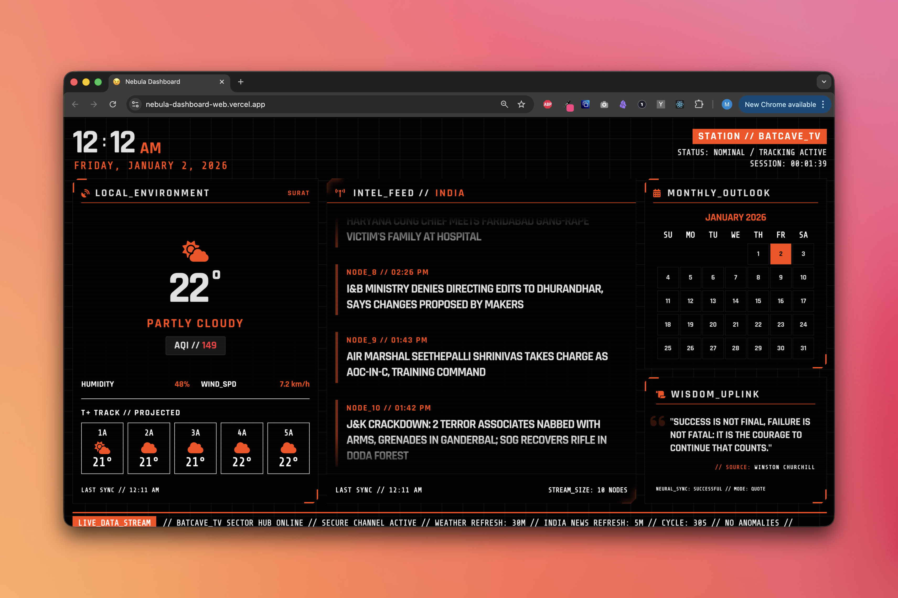

# Nebula Dashboard

A smart cybernetic dashboard command center for TV displays, providing real-time news, intel and AI-powered insights.



Your futuristic command center for daily global intel.

## What is this?

**Nebula Dashboard** is a smart cybernetic dashboard for TV displays, providing real-time intel and AI-powered insights.

- ✅ Provides real-time news, weather, and AI insights in a cyberpunk aesthetic.
- ✅ Designed for data enthusiasts and fans of futuristic, high-contrast UI/UX.
- ✅ Exists to transform any display into a high-tech information hub.
- ✅ Fully Customizable
- ✅ AI Powered Wisdom - Quotes and Word of the Day

---

## Features

- **Global Intel Feed** — Real-time news cycling from international sources.
- **Wisdom Uplink** — Daily AI-powered quotes and vocabulary enrichment.
- **Cybernetic UI** — A stunning, futuristic interface designed for ambient displays.

## Getting Started

### Prerequisites

- Git installed on your system (Comes default on macOS)
- GitHub account (for repository access)
- [Bun](https://bun.sh/) runtime installed

## Usage

### Installation

```bash
# Clone the repository
git clone https://github.com/justmalhar/nebula-dashboard.git
cd nebula-dashboard
```

### Setup & Configure

```bash
cd nebula-dashboard
./setup.sh
```

### Run

```bash
bun dev
```

## Contributing

1. Fork the repository
2. Create your feature branch (`git checkout -b feature/AmazingFeature`)
3. Commit your changes (`git commit -m 'Add some AmazingFeature'`)
4. Push to the branch (`git push origin feature/AmazingFeature`)
5. Open a Pull Request

## License

This project is licensed under the MIT License - see the [LICENSE](LICENSE) file for details.

---

## About Me

Malhar Ujawane
• Twitter/X: [https://x.com/justmalhar](https://x.com/justmalhar)
• LinkedIn: [https://linkedin.com/in/justmalhar](https://linkedin.com/in/justmalhar)
• GitHub: [https://github.com/justmalhar](https://github.com/justmalhar)
• Website: [https://malharujawane.com](https://malharujawane.com)
• Ko-fi: [https://ko-fi.com/justmalhar](https://ko-fi.com/justmalhar)

#### Repo Created with

- [Git Repository Setup Automator](https://github.com/justmalhar/git-repo-setup-automator)
